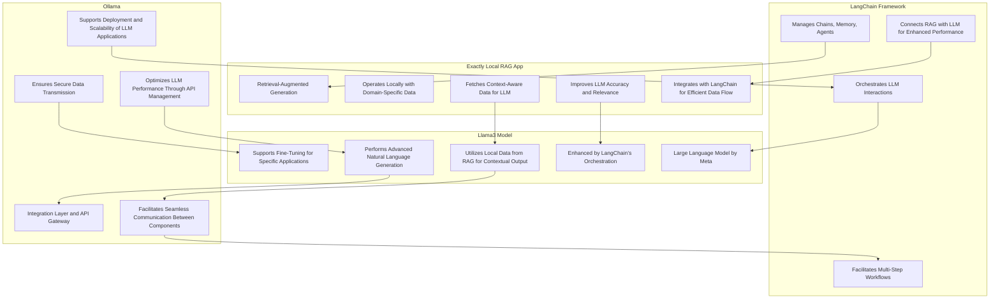

```mermaid  
graph TD
    subgraph LangChain Framework
        A1[Manages Chains, Memory, Agents]
        A2[Orchestrates LLM Interactions]
        A3[Connects RAG with LLM for Enhanced Performance]
        A4[Facilitates Multi-Step Workflows]
    end
    
    subgraph Exactly Local RAG App
        B1[Retrieval-Augmented Generation]
        B2[Operates Locally with Domain-Specific Data]
        B3[Fetches Context-Aware Data for LLM]
        B4[Improves LLM Accuracy and Relevance]
        B5[Integrates with LangChain for Efficient Data Flow]
    end
    
    subgraph Llama3 Model
        C1[Large Language Model by Meta]
        C2[Performs Advanced Natural Language Generation]
        C3[Utilizes Local Data from RAG for Contextual Output]
        C4[Enhanced by LangChain’s Orchestration]
        C5[Supports Fine-Tuning for Specific Applications]
    end
    
    subgraph Ollama
        D1[Integration Layer and API Gateway]
        D2[Facilitates Seamless Communication Between Components]
        D3[Supports Deployment and Scalability of LLM Applications]
        D4[Ensures Secure Data Transmission]
        D5[Optimizes LLM Performance Through API Management]
    end
    
    A1 --> B1
    A2 --> C1
    A3 --> B5
    B3 --> C3
    B4 --> C4
    C2 --> D1
    C3 --> D2
    D2 --> A4
    D3 --> A2
    D4 --> C5
    D5 --> C2

```
